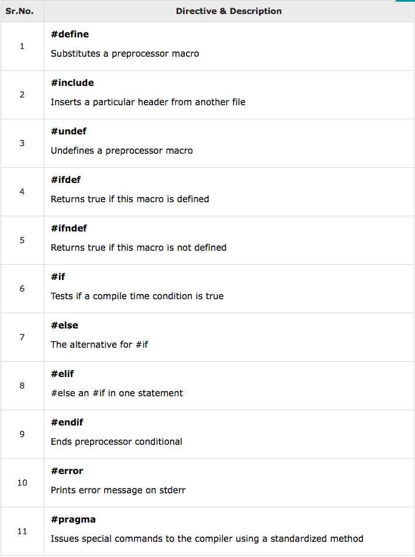

## Data Types

### Integer

#### Architecture-dependent Types

| type               | size(32-bit) | size(64-bit) |
| :----------------: | :----------: | :----------: |
| char               | 1            | 1            |
| unsigned char      | 1            | 1            |
| short              | 2            | 2            |
| unsigned short     | 2            | 2            |
| int                | 4            | 4            |
| unsigned int       | 4            | 4            |
| long               | 4            | 8            |
| unsigned long      | 4            | 8            |
| long long          | 8            | 8            |
| unsigned long long | 8            | 8            |

#### Apple Types

| type       | 32-bit       | 64-bit        |
| :--------: | :----------: | :-----------: |
| NSInteger  | int          | long          |
| NSUInteger | unsigned int | unsigned long |

#### Explicit Types

Bên cạnh **Architecture Types** và **Apple Types** còn có **Explicit Types** cho phép ta chọn size thay vì dựa vào size theo OS

Ví dụ:

```c
int8_t: 8 bits
uint16_t: 16bits
...
```

TODO: best practice when choosing type
TODO: format in string

Note: Các máy dùng chip A7 trở lên dùng 64-bit OS

### Floating-Point

| type        | size  |
| :---------: | :---: |
| float       | 4     |
| double      | 8     |
| long double | 16    |

TODO: mimic Integer section

### Number prefix/suffix

- Hexa: 0x hoặc 0X
- Otal: 0
- Unsigned: U
- Long: L
- 10^: E

Ví dụ:

```c
#define MY_CONST 0xFeeL; // hexa, type long
long myVar = 0xFee

#define MY_CONST_2 0213; // octal, int
int myVar = 0213;

#define MY_CONST_3 215u; // decimal, unsigned int
unsigned int myVar = 215;

#define MY_CONST_4 314159E-5L; // 314159x10^-5, long double
long double myVar = 314159E-5L;
```

### Constants

Có 2 cách khai báo constant

- #define

```c
// #define identifier value
#define LENGTH 10
```

- const ```const type variable = value;```

```c
// const type variable = value
const int LENGTH = 10
```

## Methods

```c
- (return_type) method_name:( argumentType1 )argumentName1
  joiningArgument2:( argumentType2 )argumentName2 ...
  joiningArgumentn:( argumentTypen )argumentNamen {
   body of the function
}
```

Method trong objective-c dị đéo chịu được. Từ argument thứ 2 trở đi được coi là ```joining argument```

```c
- (int) sum:(int) num1 secondNumber:(int) num2 {
   return num1 + num2;
}

// calling method (instance là instance của method khai báo method sum)
[instance sum:1 secondNumber:2]
```

## Blocks

Block giống function/method nhưng nó là object và có thể được pass around như là variable (giống function của Javascript)

```c
int (^sum)(int, int) = ^(int num1, int num2) {
  return num1 + num2;
};
```

Muốn truyền vào function như callback thì phải dùng typedef để định nghĩa type block argument

```c
#import <Foundation/Foundation.h>

typedef void(^CallbackBlock)(void);

@interface SampleClass:NSObject
- (void) doSomething:(CallbackBlock) cb;
@end

@implementation SampleClass
- (void) doSomething:(CallbackBlock)cb {
  NSLog(@"Do something");
  cb();
}
@end

int main() {
  SampleClass *sc = [[SampleClass alloc] init];
  [sc doSomething:^{
    NSLog(@"Done something");
  }];
  return 0;
}
```

## Arrays

Declare

```c
// type arrayName [ arraySize ];
double balance[5];
```

Declare & initialize

```c
double balance[5] = {1000.0, 2.0, 3.4, 17.0, 50.0};
```

Bỏ qua length để khai báo array với length đúng bằng số phần tử

```c
double balance[] = {1000.0, 2.0, 3.4, 17.0, 50.0};
```

NOTE: ```int arr[] = {1 ,2, 3}``` -> arr là pointer variable

## Pointers

Pointer là variable. Value của pointer là địa chỉ của 1 variable khác

Value của pointer luôn là kiểu ```long``` (hexima)

```c
int  var = 20;
int  *ip;
ip = &var;
```

## Structures

Struct là 1 dạng user-defined data type, giúp gom nhóm nhiều kiểu dữ liệu khác nhau (member)

```c
struct [structure tag] {
   member definition;
   member definition;
   ...
   member definition;
} [one or more structure variables];  
```

Struct argument

```c
- (void) printBook:( struct Books) book ;
```

Struct pointer muốn access member phải dùng ```->```

```c
struct Books book1;
book1.id = 1;
struct Books *bookPtr = &book1;

// access member
bookPtr->id
```

Note: struct không cho phép member là object pointer

## Preprocessors

Preprocessor is just a text substitution tool and it instructs compiler to do required pre-processing before actual compilation



### Parameterized Macros

```c
#import <Foundation/Foundation.h>

#define MAX(x,y) ((x) > (y) ? (x) : (y))

int main(void) {
   NSLog(@"Max between 20 and 10 is %d\n", MAX(10, 20));  
   return 0;
}
```

### Macro Continuation (\)

Dùng để xuống dòng khi define macro

```c
#define TEST "Hello " \
             "World"
```

### defined() Operator

Dùng chung với #if

```c
#if !defined (MESSAGE)
   #define MESSAGE "You wish!"
#endif
```

Ngoài ra còn có các operator như ```stringize #```, ```token pasting ##``` thường dùng để replace text, argument cho các parameterized macro

## Typdef

typedef dùng để định nghĩa alias cho type

```c
typedef unsigned char BYTE;
```

Có thể dùng được cả với user-defined data type như struct

```c
typedef struct Book {
   int id;
   int quality;
} Book;

// thay vì
struct Book book1;

// chỉ cần
Book book1;
```

### typdef vs #define

```typedef``` và ```#define``` đều có thể định nghĩa alias cho type nhưng:

- ```#define``` còn có thể định nghĩa alias cho value
- ```typedef``` được xử lý bởi **compiler** còn ```#define``` được xử lý bởi **pre-processor**

TODO: find best practice to choose which to use in different contexts

## Classes And Objects

Note:
- object còn hay được gọi là ```receiver```
- method không phân biệt được ivar và argument cùng tên nên phải dùng ```self->ivar``` hoặc đặt tên khác nhau

### Property

@property giúp tự định nghĩa setter, getter. Ngoài ra nó còn cho phép access ivar bằng dot operator thay vì phải gọi setter, getter

TODO: property attributes(access specifiers)

## Categories

Category dùng để thêm method cho class

Có thêm dùng Categories để thêm method cho cả các class mà ta k có source code (built-in class)

``` c
@interface NSString(MyAdditions)
+(NSString *)getCopyRightString;
@end

@implementation NSString(MyAdditions)
+(NSString *)getCopyRightString {
   return @"Copyright TutorialsPoint.com 2013";
}
@end
```

## Extensions

Extension cũng dùng để them method cho class. Extension còn được gọi là **anonymous category** vì cú pháp chỉ khác so với Category là k có tên

```c
@interface ClassName ()

@end
```

Các điểm khác so với Category:

- Extension chỉ dùng được với các class mà ta có source code vì nó cần được compile cùng với class

- Các ivar và method khai báo trong Extension sẽ private và chỉ có class đó mới access được

```c
@interface SampleClass : NSObject {
   NSString *name;
}

- (void)setInternalID;
- (NSString *)getExternalID;

@end

@interface SampleClass() {
   NSString *internalID;
}

@end
```

## Protocols

Protocol giống Interface trong Java

Dùng để định nghĩa các property, method dành riêng cho 1 task

1 class có thể implement nhiều Prototcol

```c
// declare protocol
@protocol ProtocolName
@required
// list of required methods
@optional
// list of optional methods
@end

// implement protocol
@interface SampleClass:NSObject<ProtocolName>

@end
```

## Class Cluster

Class cluster là 1 kiến trúc, design pattern giúp tạo ra 1 public, abstract superclass bằng cách gom nhóm các private, concrete class

Ví dụ: NSNumber là 1 public, abstract superclass, nó gom nhóm các private, concrete class như int, float... Khi tạo 1 instance từ

Khi khởi tạo pubic class, ta sẽ nhận được instance của private class tuỳ theo cách ta khởi tạo public class

```c
// khởi tạo bằng int
+ (NSNumber *)numberWithInt:(int)value

// khởi tạo bằng float
+ (NSNumber *)numberWithFloat:(float)value

// khởi tạo bằng bool
+ (NSNumber *)numberWithBool:(BOOL)value
```

Trong Java, abstract class không được khởi tạo. Trong Objective-C cũng vậy. Thật ra nó chỉ khởi tạo private, concrete class. Nhưng nhờ class cluster pattern, các instance tạo ra đều được coi như là instance của abstract class -> giúp API đơn giản, dễ học, dễ dùng

Trade-off của class cluster là khó tạo subclass. Ta phải tự declare store, override primitive method của abstract superclass. Nhưng ta có thể tránh việc tạo subclass từ class cluster bằng cách compose (next section)

## Composite Object

Như đã đặt vấn đề ở phần trên, việc subclass class cluster rất lằng nhằng vì vậy thay vào đó ta dùng composite object

Composite object sẽ extend 1 class cluster đồng thời có embed 1 ivar là instance của class cluster đó. Và vì extend class cluster nên nó phải override các primitive method của class cluster, nhưng vì đã có embed cluster object nên việc này trở nên dễ dàng


```c

- (unsigned)count  {
   return [clusterObject count];
}

```

Và ta có chỉ cần thực sự override method nào mà ta cần customize

```c

- (void)addObject:object {
  // do whatever you want
  if (object != nil) {
      [embeddedArray addObject:object];
   }
}

```

[Full Example](https://www.tutorialspoint.com/objective_c/objective_c_composite_objects.htm)

## Misc (put them in right section later)

- In float ra dạng Scientific Notation: %e. Dùng %g để NSLog quyết định format %f hoặc %e (mũ lớn hơn 5 hoặc nhỏ hơn -4 sẽ dùng %e)
- float const mặc định là double. Để chỉ định là float phải thêm f hoặc F vào cuối
- Behind the scenes, an object’s instance variables are stored as a struct
- property attributes: http://www.binpress.com/tutorial/learn-objectivec-objects-part-2-properties/59
- static variable trong objective-c có thể được định nghĩa theo Class hoặc theo từng method (static local varible)
- id type: can hold any object type

## TODO

- extern
- bit fields
- Introspection
- delegate
- lvalue, rvalue
- Memory Management